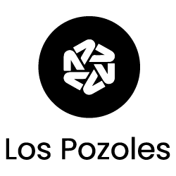
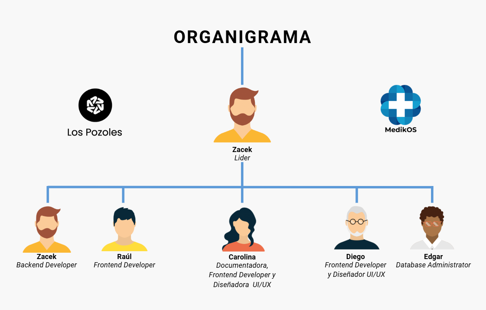
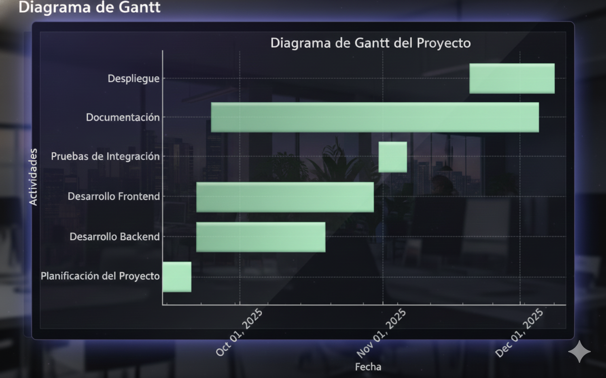

# MedikOs

## Introducción  
**MedikOs** es un sistema integral para la **gestión hospitalaria digitalizada**. El proyecto busca digitalizar la operación de hospitales y clínicas, mejorando la eficiencia y calidad de la atención médica.  
A través de una plataforma web, una API REST, análisis de datos y una base de datos robusta, **MedikOs** permite gestionar citas médicas, expedientes clínicos y recursos hospitalarios, optimizando los tiempos de atención y reduciendo los costos operativos.

---

## Identidad Gráfica

| Logo del Producto | Logo de la Compañia |
|-------------------|------------------|
|  |  |

---

## Descripción  
**MedikOs** integra tecnologías modernas para ofrecer una plataforma completa que cubre desde la administración de citas médicas hasta la gestión de expedientes clínicos.  
El sistema incluye módulos para:
- **Gestión de usuarios** (médicos, pacientes, administrativos).
- **Programación y gestión de citas médicas**.
- **Acceso y actualización de expedientes clínicos**.
- **Generación de reportes y análisis de la eficiencia hospitalaria**.

---

## Planteamiento del problema  
En muchos hospitales y clínicas, los procesos son gestionados manualmente, lo que genera:  
- Retrasos frecuentes y tiempos de espera altos.
- Poca transparencia en la gestión de recursos médicos.
- Falta de datos para la toma de decisiones administrativas y médicas.
- Experiencia de usuario limitada y poco accesible.

---

## Propuesta de solución  
**MedikOs** propone un sistema integral y digital para la gestión hospitalaria que incluye:  
- **Frontend web** en **Vue.js** para la administración y visualización de datos.
- **API REST** en **FastAPI** para la gestión centralizada de la lógica de negocio.
- **Base de datos MongoDB y PostgreSQL** para almacenamiento confiable y estructurado.
- **Módulos de reportes** para la generación de informes sobre eficiencia y uso de recursos.
- **Seguridad** con autenticación JWT, control de roles y cifrado de datos.
- **Despliegue en contenedores Docker** para facilitar la instalación y escalabilidad.

---

## Objetivo General  
Desarrollar e implementar un sistema integral que optimice la gestión hospitalaria, mejorando la eficiencia operativa, la calidad de atención médica y la experiencia de los pacientes.

---

## Objetivos Específicos  
1. Implementar un sistema para la gestión de citas médicas y expedientes clínicos.
2. Proporcionar un seguimiento en tiempo real del estado de los pacientes.
3. Desarrollar un módulo de reportes con indicadores clave sobre el rendimiento hospitalario.
4. Mejorar la gestión de recursos (personal médico, insumos, equipos).
5. Garantizar seguridad y control de acceso a la información médica.

---

## Organigrama de Trabajo

**Organigrama** 
    ├── **Frontend Developer** (Raúl)  
    ├── **Backend Developer** (Zacek) 
    ├── **Frontend Developer** (Diego) 
    ├── **Database Administrator** (Edgar) 
    └── **Documentadora** y **Frontend Developer** (Caro)

---

## Tabla de Colaboradores

| Nombre Completo | Rol                    | GitHub                                |
|-----------------|------------------------|---------------------------------------|
| **Caro**        | Documentadora & Frontend Developer | [GitHub](https://github.com/CarolinaAR10) |
| **Raúl**        | Frontend Developer     | [GitHub](https://github.com/RaulReyesB) |
| **Zacek**       | Backend Developer      | [GitHub](https://github.com/Zac-ek)    |
| **Edgar**       | Database Administrator | [GitHub](https://github.com/Ederdal) |
| **Diego**       | Frontend Developer     | [GitHub](https://github.com/DiegoMota) |

---

## Diagrama de Gantt  

El presente Diagrama de Gantt refleja la planificación detallada del proyecto desde el 15 de septiembre hasta el 8 de diciembre de 2025. A lo largo de este período, se han establecido diversas fases de trabajo clave, incluyendo la planificación del proyecto, el desarrollo del backend y frontend, las pruebas de integración, la documentación y el despliegue final del sistema. La visualización de las actividades y sus respectivas duraciones permite un seguimiento claro y preciso de los avances, asegurando que cada tarea se cumpla en los plazos estipulados.

Este cronograma no solo facilita la organización del equipo de trabajo, sino que también ofrece una perspectiva global sobre el progreso y los hitos importantes del proyecto. Las fechas establecidas permiten un enfoque estratégico en cada fase, minimizando posibles retrasos y maximizando la eficiencia en la ejecución del proyecto.

El uso de un diagrama de Gantt en este contexto contribuye a la gestión efectiva del tiempo y recursos, promoviendo una colaboración eficiente entre los miembros del equipo y garantizando la entrega puntual del proyecto con todas sus funcionalidades completas.

---

## Lista de Tecnologías  
- **Backend:** FastAPI  
- **Frontend:** Vue.js  
- **Base de Datos:** MongoDB, PostgreSQL  
- **Data:** Python, Pandas  
- **Infraestructura:** Docker, Nginx  
- **Control de Versiones:** GitHub  
- **Gestión de Proyecto:** Jira, Trello  
- **Documentación:** Swagger, Markdown

---

## Diseños de Figma  
- ## **Paciente-Móvil**:  

- ## **Médico-Móvil**:  

- ## **Admin-Web1**:  

- ## **Admin-Web2**:  

---
## Conclusión
Este proyecto tiene como objetivo el desarrollo de un sistema integral que abarca desde la planificación hasta el despliegue final, pasando por etapas cruciales como el desarrollo backend y frontend, la integración de pruebas y la documentación. A lo largo del proceso, se ha mantenido un enfoque estratégico para asegurar el cumplimiento de los plazos establecidos, lo cual ha sido facilitado por el uso del Diagrama de Gantt para organizar las actividades y distribuir tareas de manera eficiente entre los miembros del equipo.

El trabajo colaborativo y la gestión efectiva del tiempo, apoyados por una estructura bien definida, han permitido avanzar con éxito en la construcción de un sistema robusto y funcional. La utilización de herramientas de planificación y la división clara de tareas en este proyecto garantizan no solo el cumplimiento de los objetivos, sino también la calidad y el buen desempeño del producto final.

Este enfoque metodológico y la implementación de cada fase dentro del tiempo estipulado han demostrado ser esenciales para mantener un flujo de trabajo continuo, eficiente y orientado a resultados. Con este sistema, se espera optimizar los procesos y cumplir con las expectativas del usuario final.
